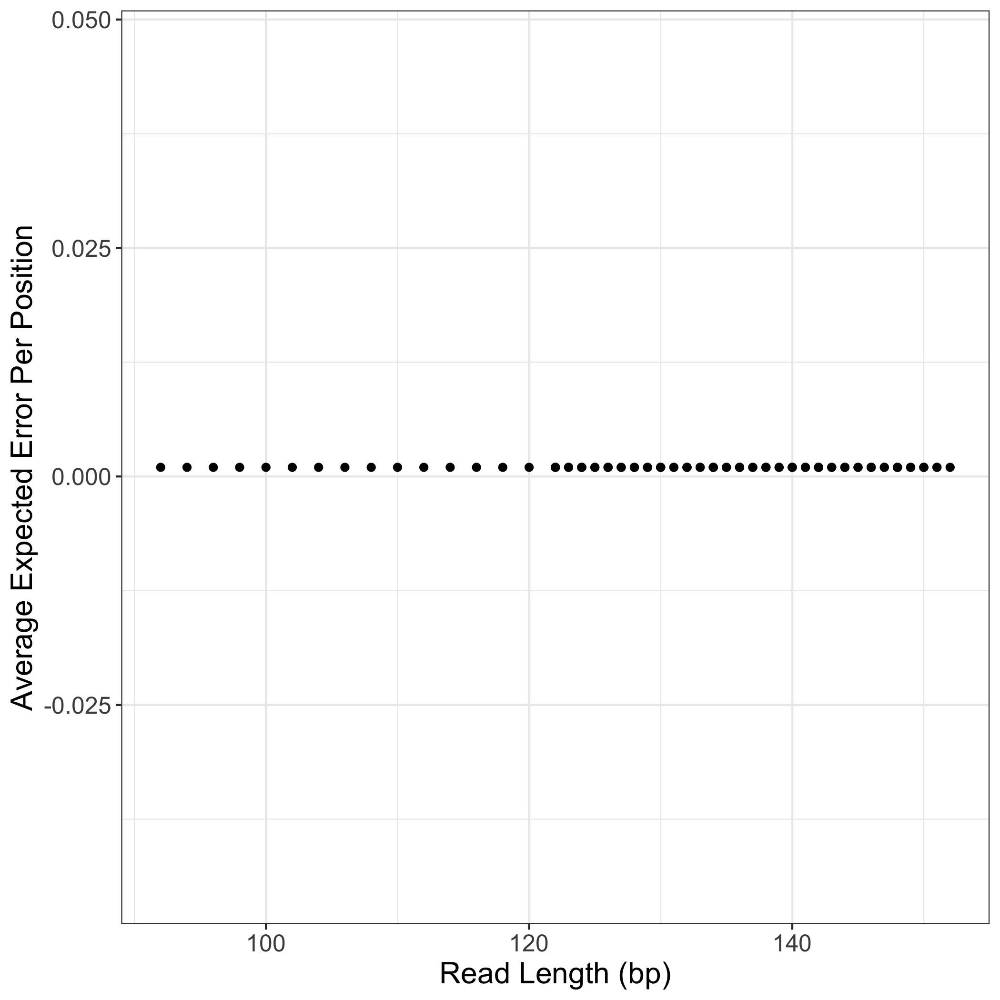
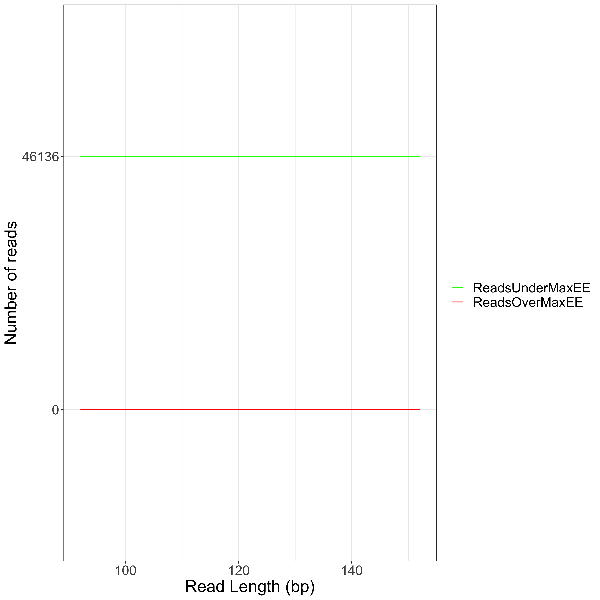
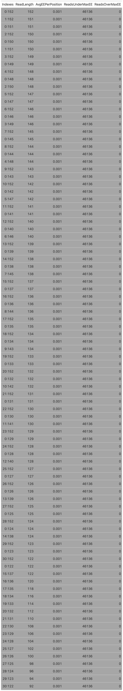

# SmartDADA2 Report 

## Objective 

When using 16S rRNA sequencing data there are three things that must be optimized
when performing quality control on your reads: 

1. Read length (as the longer the read the better the taxonimical classification)
2. Quality of the read (increasing the accuracy)
3. Number of reads (to ensure the most robust picture of the mirobial community)

In order to maximize these factors this program has been designed to provide 
evidence for picking certain parameter values in the commonly used program DADA2 
that is used to perform quality control in 16S rRNA seq processing pipelines. 

## Findings 

### Read Length and Quality 

Here we plotted different sized reads by the average expected error per base. 
Each point is associated with a different set of left and right trim values. 

Note: It is important to understand that a read can be of the same length with 
different trimming values. For example, a read can be 100 bp long if trimmed from
0-100 or from 10-110. 

In this table we filtered for: 

1. Rows containing the max read length 
2. All rows who were within the 25% quantile of the average expected error per position

Note: Highlighted in grey are the rows containing the highest read length and the lowest average expected error per position.

### Read Length by Maximum Expected Error 

DADA2 has a parameter called maxEE which is the max number the sum of the 
expected error for a read should be. It defaults to 2.0, meaning that any read
with an error higher than 2.0 will be discarded. 

This plot is designed to show how many reads are above and below this threshold 
by different read sizes. This is in an effort to show whether increasing the max
expected error might yield significantly more reads for downstream analyses. 

In this table we filtered for:

1. All rows within the 75% quantile of the number of reads over max expected error 

Note: Highlighted in grey are the rows containing the max number of reads over the max expected error.

