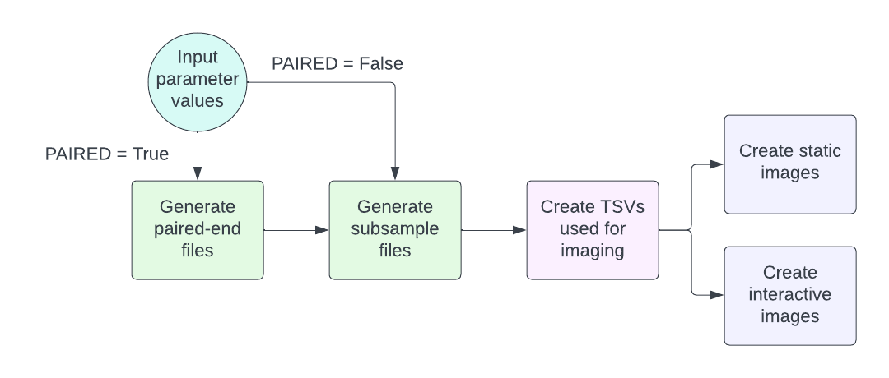
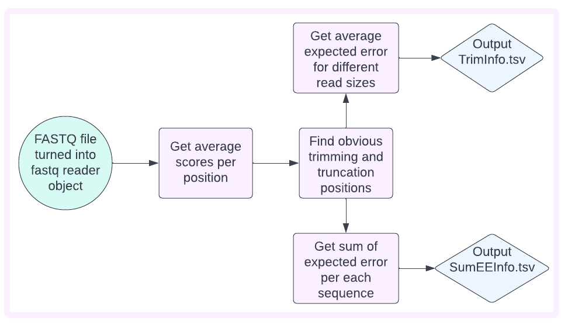

% SMARTDADA2 documentation master file, created by
% sphinx-quickstart on Wed May 24 22:33:54 2023.
% You can adapt this file completely to your liking, but it should at least
% contain the root `toctree` directive.

# Welcome to SMARTDADA2's Page

- [Welcome to SMARTDADA2's Page](#welcome-to-smartdada2s-page)
  - [Current State of the Problem](#current-state-of-the-problem)
  - [Out Approach to Solve the Problem](#out-approach-to-solve-the-problem)
  - [Goals For the Implementations](#goals-for-the-implementations)
  - [Usage](#usage)
    - [Installing SMARTDADA2](#installing-smartdada2)
    - [Executing SMARTDADA2's Snakemake Workflow](#executing-smartdada2s-snakemake-workflow)
  - [In Depth understanding of method](#in-depth-understanding-of-method)
    - [Understanding `FastqReader`](#understanding-fastqreader)
    - [SMARTDADA2's Snakemake workflow](#smartdada2s-snakemake-workflow)
  - [Citations](#citations)


## Current State of the Problem

While much effort has been put into microbiome focused 16S rRNA sequencing data processing pipelines, they are certainly nowhere near automated (Eetemadi et al.).
A crucial step in these processes is quality control (e.g., the removal of low-quality reads from downstream analyses), and one commonly used method is DADA2 (Callahan et al.).
Unfortunately, DADA2 parametrization (see all possible parameters [here](https://docs.qiime2.org/2023.5/plugins/available/dada2/denoise-paired/)) remains a topic of confusion. A quick google search reveals forums where people title their posts “[intuition for appropriate filtering parameters](https://github.com/benjjneb/dada2/issues/236)” and no empirical way of determining parameter values is given.
Thus, for those beginning their use of DADA2 and microbiome pipelines it becomes a guessing game.

## Out Approach to Solve the Problem

To help a user understand how to pick DADA2 parameter values we chose to focus on three specific parameters:

- `--p-trunc-len`: index/position on the read where you want to truncate (end)
- `--p-trim-left`: index/position on the read where you want to trim (start)
- `--p-max-ee`: max expected error, a threshold wherein if the sum of the error of the read is higher than this, the read will be automatically discarded.

These three parameters can also be different for forward and reverse reads if the user is conducting a paired-end study.

Furthermore, when performing quality control there are three things a user will wish to optimize:

- Quality: the higher the quality scores the higher your assurance that the base call is correct
- Read length: the longer the read the higher the taxonomic resolution
- Read retention: the more reads that can be retained the more accurate the results will be (e.g., microbes that are present in lower concentrations will be more easily seen)

## Goals For the Implementations

Here we present SMARTDADA2, a software designed to provide the user with more information about the quality of the reads and how changes in the three parameters we focused on may influence the three things we’re hoping to optimize.
This program was built to be accessible, efficient and provide an informative set of outputs that a user can use to make DADA2 parameter value choices.

## Usage

### Installing SMARTDADA2

clone repository

`git clone https://github.com/acolorado1/SMARTDADA2.git`

create environment

`conda env create -f smartdada2_env.yaml`

activate environment

`conda activate smartdada2`

install `SMARTDADA2` into local environment

`pip install -e .`

### Executing SMARTDADA2's Snakemake Workflow

There are several adjustable parameters that a user may want to change when running this program.

- `FASTQ_FILE`: File path to a FASTQ formatted file using Illumina formatting conventions.
- `PAIRED` (bool): True or False. If True then you are using paired-end reads.
- `SUBSAMPLE` (int): Number of reads you want to use when creating visualizations. Standard QIIME2 (Bolyen et al.) visualizations take a subsample of 10,000 reads.
- `AVG_Q_SCORE` (default = 30.0): This threshold will denote the position where the average quality score in the reads drops below this number.
- `OBV_TRIMMING_MAX` (default = 0.1): If the position where the average quality score is below the chosen threshold is further than this percentage on either end of the read a warning is shown. The default warns if position where average quality is poor, is over 10% of the read on either end.
- `MAX_TRIMMING` (default = 0.2): Calculates max index trimming on either end when finding average expected error for position. Default will only calculate up to 20% trim/truncating on each end.

To change these parameters values, open the Snakefile in the directory created by cloning the repository using any text editors and adjust as needed.

```text
FASTQ_FILE = "../DADA2ParameterExploration/smartdada2/testing/test_data/LOZ_Nano_Trunc.fastq"
PAIRED = True
SUBSAMPLE = 2
AVG_Q_SCORE = 30
OBV_TRIMMING_MAX = 0.1
MAX_TRIMMING = 0.2
```

Then in the terminal (make sure you are in the cloned repo directory) run the following command:

- snakemake –c 1

The number 1 denotes the number of cores used to run the workflow. If you are using paired end reads it is highly recommended that you use 2 or more cores.

## In Depth understanding of method

### Understanding `FastqReader`

FastqReader is a memory efficient class that takes in FASTQ files and starts collecting information from the input sequences in order to find characteristics of the reads. The extracted characteristics play an essential role in determining DADA2 parameterization.

To see the full list of please refer to the `smartdada2` `FastqReader` [API](./modules.md), where each method within the `FastqReader` extracts specific characteristics.

The majority of these methods are used within the `Snakemake` workflow where users can provide specific parameters on how characteristics help objectively determine trimming parameters.

### SMARTDADA2's Snakemake workflow



- Generate paired-end files
  - We used standard Illumina file formatting to detect whether a read belonged to the forward or reverse primer and created output directories named forward or reverse with files containing the reads. Should single-end reads be used only a forward directory will be created.
- Generate subsample
  - Subsampling was done using reservoir sampling wherein the first n samples were picked (n being the number of samples specified) and then replaced “randomly” (a default seed was indicated) with other reads.
- Create TSVs used for imaging



- Reads whose quality scores are taken and averaged by position are used to obtain which at which position does the quality drop below the specified threshold (see AVG_Q_SCORE parameter in demo). This is done by starting in the middle of the read and traveling over the list of average quality scores heading either left or right to find the first instance below the threshold (this is referred to as obvious trimming/truncating).
- The average expected error of the reads is then calculated for different combinations of trim and truncation values. MAX_TRIMMING will determine how much of the read is trimmed/truncated for this calculation. TrimInfo.tsv is then output.

- The sum of the expected error for each read is then calculated should no trimming/truncating be performed and when obvious trimming/truncating is used. SumEEInfo.tsv is output.

- Creating plots
  - Static images (found in the plots folder of the output) as well as an html file containing interactive versions of the images are then generated using R scripts. Three plots are generated to visualize:
    - Trimming and truncating combinations and the effect that will have on quality scores.
    - Read length and its effect on quality.
    - The number of reads retained with no trimming and obvious trimming by plotting sum of expected error as a histogram. There is a vertical line at 2 as it is a DADA2 default wherein any reads over 2 will be discarded.

## Citations

1. Bolyen E, Rideout JR, Dillon MR, Bokulich NA, Abnet CC, Al-Ghalith GA, Alexander H, Alm EJ, Arumugam M, Asnicar F, Bai Y, Bisanz JE, Bittinger K, Brejnrod A, Brislawn CJ, Brown CT, Callahan BJ, Caraballo-Rodríguez AM, Chase J, Cope EK, Da Silva R, Diener C, Dorrestein PC, Douglas GM, Durall DM, Duvallet C, Edwardson CF, Ernst M, Estaki M, Fouquier J, Gauglitz JM, Gibbons SM, Gibson DL, Gonzalez A, Gorlick K, Guo J, Hillmann B, Holmes S, Holste H, Huttenhower C, Huttley GA, Janssen S, Jarmusch AK, Jiang L, Kaehler BD, Kang KB, Keefe CR, Keim P, Kelley ST, Knights D, Koester I, Kosciolek T, Kreps J, Langille MGI, Lee J, Ley R, Liu YX, Loftfield E, Lozupone C, Maher M, Marotz C, Martin BD, McDonald D, McIver LJ, Melnik AV, Metcalf JL, Morgan SC, Morton JT, Naimey AT, Navas-Molina JA, Nothias LF, Orchanian SB, Pearson T, Peoples SL, Petras D, Preuss ML, Pruesse E, Rasmussen LB, Rivers A, Robeson MS, Rosenthal P, Segata N, Shaffer M, Shiffer A, Sinha R, Song SJ, Spear JR, Swafford AD, Thompson LR, Torres PJ, Trinh P, Tripathi A, Turnbaugh PJ, Ul-Hasan S, van der Hooft JJJ, Vargas F, Vázquez-Baeza Y, Vogtmann E, von Hippel M, Walters W, Wan Y, Wang M, Warren J, Weber KC, Williamson CHD, Willis AD, Xu ZZ, Zaneveld JR, Zhang Y, Zhu Q, Knight R, and Caporaso JG. 2019. Reproducible, interactive, scalable and extensible microbiome data science using QIIME 2. Nature Biotechnology 37: 852–857. <https://doi.org/10.1038/s41587-019-0209-9>
2. Callahan, B. J., McMurdie, P. J., Rosen, M. J., Han, A. W., Johnson, A. J. A., & Holmes, S. P. (2016). DADA2: High-resolution sample inference from Illumina amplicon data. Nature methods, 13(7), 581-583.
3. Eetemadi, A., Rai, N., Pereira, B. M. P., Kim, M., Schmitz, H., & Tagkopoulos, I. (2020). The computational diet: a review of computational methods across diet, microbiome, and health. Frontiers in microbiology, 11, 393.

```{toctree}
:caption: 'Contents:'
:maxdepth: 2
```

<!-- % Indices and tables

% ==================

% * :ref:`genindex`

% * :ref:`modindex`

% * :ref:`search` -->
